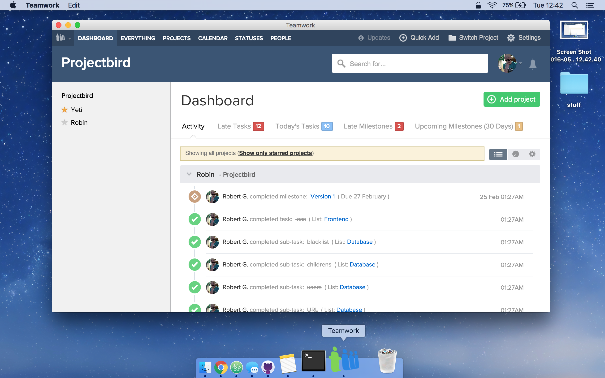

# About
This Project does what it says on the tin. Wrap web apps natively for osx or windows <3

# Installation

```shell
npm install websitewrapper -g
```

# Usage
You need to pass three things into it.
- -u or -url :  The url of the website you want to create the shortcut for.
- -t or -title : The title of the website.
- -i or icon: The icon (its full path) you want pass (To convert images to icns visit [iconverticons](https://cloudconvert.com/png-to-icns) )

It will then create a folder called build on your desktop. Everything is in there now.

## Command

```shell
websitewrapper -url http://www.google.ie -title Google -icon /Users/robertjgabriel/desktop/icon.icn
```
## Test
This will cretae a default package
```shell
npm test
```

## Code

```javascript
var websitewrapper = require('websitewrapper'),

  websitewrapper.create("http://www.google.ie","google","logo.icns");
```

# Support
- OSX 64 bit
- Windows 64 bit (Windows 7 + )

# Example
As you can see stupid project really but a nice on all the same.


